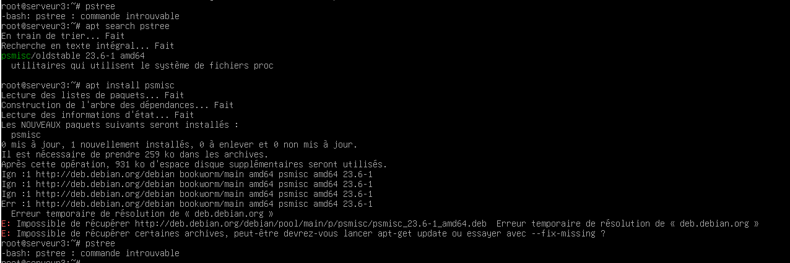
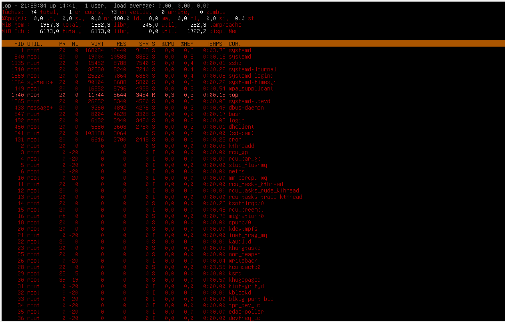
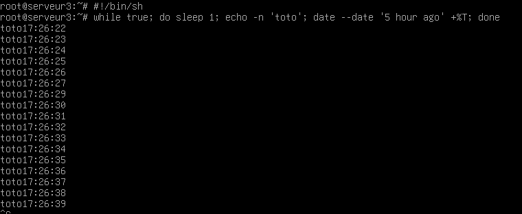
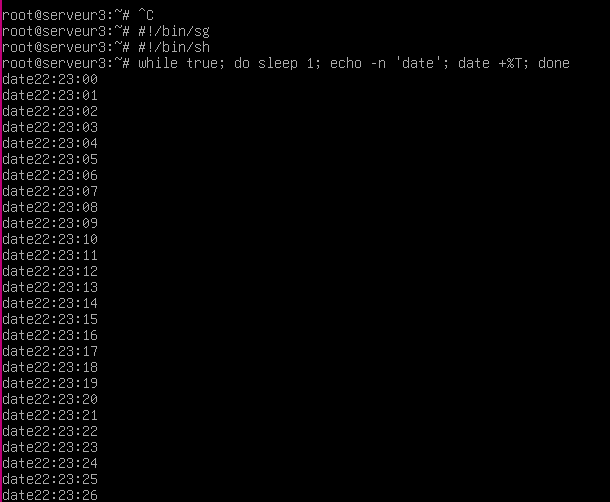

# Compte Rendu TP 02 : Services, Processus et Signaux

**Étudiante :** SAHRAOUI Selma
**Formation :** LP Projet Web et Mobile 
**Enseignant :** M. Le Cocq

## 2\. Étude des Processus

  

### 2.1 Analyse via la commande `ps`

Pour obtenir une vue d'ensemble de ce qui tourne sur ma machine, j'ai utilisé la commande `ps aux`. D'après ce qu'on a vu en cours, cette commande permet de lister tous les processus de tous les utilisateurs.

**Analyse des colonnes :**

-   **TIME :** J'ai remarqué que la colonne `TIME` affichait souvent `0:00`. En consultant le `man`, j'ai compris que cela ne représente pas la durée de vie du processus, mais le temps exact durant lequel le processeur a travaillé pour lui. Et comme ma VM est au repos, la consommation est assez faible.
-   **CPU & RAM :** Le processus le plus grand  est `systemd`.
-   **Démarrage (Boot) :**
-   Le tout premier processus lancé est **systemd** , il porte le **PID 1**.
-   En regardant la colonne `START` de ce processus, j'ai vu que ma machine a démarré à **22:23**.     
    
-   **Nombre de processus :** En regardant le PID le plus élevé dans la liste qui était autour de 1740, j'ai pu estimer le nombre total de processus créés depuis le démarrage, car les PIDs sont attribués séquentiellement.

  

### 2.2 Généalogie (PPID) et Visualisation

.

-   **Méthode 1 :** J'ai utilisé l'option `ps -l` pour voir la colonne PPID.
-     
    
-   **Méthode 2 :** J'ai utilisé la commande `ps afu` recommandée dans le cours pour voir l'arbre hiérarchique.
-   _Chaîne observée :_ `systemd` (1) → `sshd` (Service) → `sshd` (Ma session) → `bash` → `ps`.

**Problème rencontré avec** `**pstree**` **:**

L'énoncé demandait d'utiliser `pstree`. J'ai tenté de l'installer via le paquet `psmisc` (`apt install psmisc`), mais j'ai rencontré des difficultés techniques donc je n'ai pas pu faire cette partie.

Voici une capture d'écran de la tentative :

  

## 3\. Supervision Temps Réel (Top & Htop)

  

Contrairement à `ps` qui est une photo instantanée, `top` rafraîchit l'affichage périodiquement.

**Manipulations effectuées dans** `**top**` **:**

-   J'ai utilisé la touche `M` (Maj+m) pour trier les processus par occupation mémoire.
-   J'ai utilisé `z` pour mettre de la couleur et `x` pour surligner la colonne de tri, ce qui rend la lecture plus agréable.

**Comparaison avec** `**htop**` **:**

J'ai ensuite testé `htop`. C'est beaucoup plus visuel : on a des barres de progression pour le CPU et la RAM. C'est plus moderne que `top`.

## 4\. Gestion des Tâches et Signaux

  

### 4.1 Les scripts de test

  

J'ai créé deux scripts (`date.sh` et `toto.sh`) contenant des boucles infinies pour simuler une activité.

  

### 4.2 Job Control (Ctrl-Z, fg, bg)

  

1.  **Ctrl-Z :** Envoie le signal **SIGTSTP** (20). Cela a "gelé" mon script et me l'a mis en arrière-plan (état "Stopped").
3.  **fg %1 :** A ramené le script au premier plan.
4.    
    
5.  **Ctrl-C :** A envoyé le signal **SIGINT** (2), ce qui a tué le processus pour de bon.

  

### 4.3 Arrêt par PID (Kill)

  

J'ai relancé les scripts en tâche de fond (`&`). J'ai récupéré leurs PIDs avec `ps` puis je les ai arrêtés :

-   Commande : `kill <PID>`
-   _Explication :_ Par défaut, cela envoie le signal **SIGTERM (15)**, qui demande poliment l'arrêt. Si le processus avait bloqué, j'aurais dû utiliser `kill -9` (**SIGKILL**) pour forcer l'arrêt immédiat.

  

## 5\. Les Tubes (Pipes)

  

J'ai analysé la différence entre les commandes de redirection :

-   `**ls | cat**` **:** Le tube `|` envoie la liste à `cat` qui l'affiche. Résultat identique à `ls` simple.
-   `**ls > liste**` **:** La redirection `>` écrit tout dans le fichier "liste". Rien ne s'affiche à l'écran.
-   `**ls | tee liste**` **:** C'est la plus intéressante. La commande `tee` (en forme de T) divise le flux : elle écrit dans le fichier **ET** affiche à l'écran en même temps.

## 6\. Logs et Matériel

  

### 6.1 Journal Système (Rsyslog)

-   **État :** Le service est bien actif (`systemctl status rsyslog`).
-   **Configuration :** Le fichier `/etc/rsyslog.conf` m'indique que les messages standards vont dans `/var/log/syslog` et les infos de sécurité (connexions SSH) dans `/var/log/auth.log`.
-     
    

### 6.2 Surveillance temps réel (Cron & Tail)

Le service **cron** sert à exécuter des tâches planifiées (comme faire le café le matin)

Pour voir son activité, j'ai utilisé `tail -f /var/log/syslog`.

-   **Observation :** En redémarrant cron dans un autre terminal (`systemctl restart cron`), j'ai vu apparaître instantanément les lignes "Stopping cron" et "Starting cron". Cela prouve que le log se remplit en temps réel.
-     
    

### 6.3 Matériel (Dmesg)

La commande `dmesg` m'a permis de voir les messages du noyau au démarrage (buffer circulaire).

-   **CPU :** `dmesg | grep -i CPU` m'a montré le type de processeur virtuel utilisé .

**Sources consultées :**

-   Support de cours 1 Introduction Systèmes/Services Unix .
-   Support de cours 2 Services, processus, signaux .
-   Pages de manuel (`man ps`, `man top`, `man signal`).
